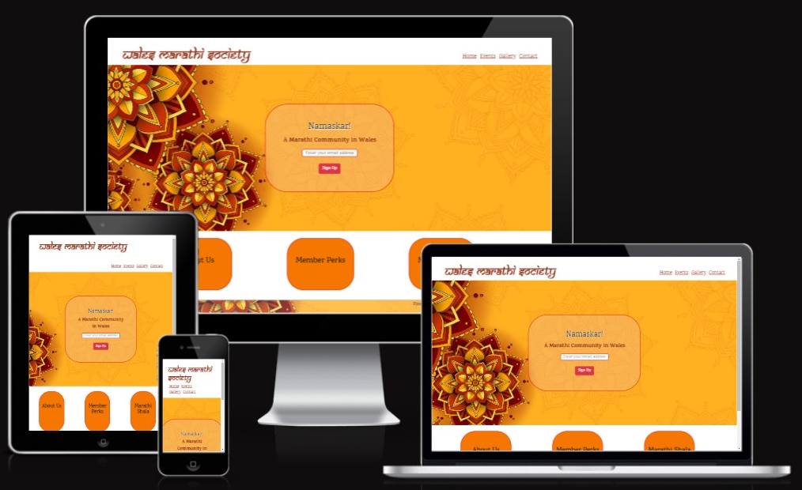
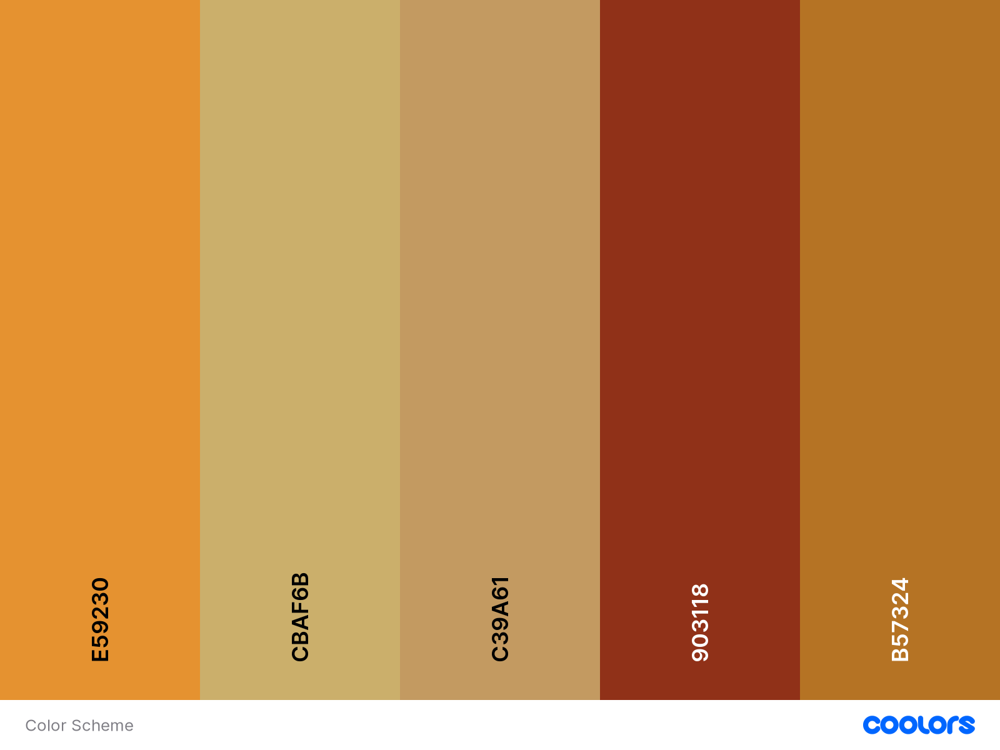

# Wales Marathi Society Website
###### Code Institute / User-Centric Front-End Development / Milestone Project 1
------------
[View Live Project Here](https://ashwinsel.github.io/Milestone-1/ "View Live Project Here")

As a part of Milestone Project 1 to demonstrate an understanding of user-centric Front-End Development, I have designed and deployed this website for a local public group for the Marathi Society residing in Wales. I have been mindful to keep it simple yet smart and accessible to audience of all ages and technical abilities.
Wales Marathi Society is a site that serves as a point of contact for people residing wales from Marathi speaking community of India. We are a social, non-political, community-driven organisation for all Marathi speaking population who are also residents of Wales. We are run by the members of our community coming together to celebrate our cultural traditions. This site is advertises the available benefits of being a memeber and the events organised by the Wales Marathi Society. This site targets first time visitors to feel excited about joining the society and partake in activities Organised which are promotes Marathi culture and also to returning users to be able to acess photographs from previous events and to find out about upcoming events.

## Index - Table of Contents
------------

+ [User Experience (UX)](#-user-experience-ux)
	* [User Stories](#user-stories)
		- [First Time Visitor Goals](#first-time-visitor-goals)
		- [Returning Visitor Goals](#returning-visitor-goals)
		- [Frequent User Goals](#frequent-user-goals)
		- [Organisation Goals](#organisation-goals)
+ [UX Planes](#ux-planes)
	* [Strategy](#strategy)
		- [Project Goals](#project-goals) 
		- [Customer Goals](#customer-goals)
		- [Company Goals](#company-goals)
		- [Future Implementations](future-implementations)
	* [Scope](#scope)
	* [Structure](#structure)
	* [Skeleton](#skeleton)
		- How is information logically grouped on the site
	* [Surface](#surface)
		- [Colour Scheme](#colour-scheme)
		- [Typography](#typography)
		- [Imagery](#imagery)
+ [Structure](#structure)
	* [Home Page](#home-page)
		- [Features](#home-page-features)
			- [F1.1 Navigation Bar](f11-navigation-bar)
			- [F1.2 Landing Page](f22-landing-page)
			- [F1.3 Information Cards](f13-information-cards)
			- [F1.4 Footer](f14-footer)
	* [Events Page](#events-page)
		- [Features](#events-page-features)
			- [F2.1 Navigation Bar](f21-navigation-bar)
			- [F2.2 Event 1](f22-event-1)
			- [F2.3 Event 2](f23-event-2)
			- [F2.4 Footer](f24-footer)
	* [Gallery Page](#gallery-page)
		-  [Features](#gallery-page-features)
			- [F3.1 Navigation Bar](f31-navigation-bar)
			- [F3.2 Event Title](f32-event-title)
			- [F3.3 Photograph Grid](f33-photograph-grid)
			- [F3.4 Event Title](f34-event-title)
			- [F3.5 Photograph Grid](f35-photograph-grid)
			- [F3.6 Event Title](f36-event-title)
			- [F3.7 Photograph Grid](f37-photograph-grid)
			- [F3.8 Footer](f38-footer)
	* [Contact Page](#contact-page)
		- [Features](#contact-page-features)
			- [F4.1 Navigation Bar](f41-navigation-bar)
			- [F4.2 Contact Form](f42-contact-form)
			- [F4.3 Image](f43-image)
			- [F4.4 Footer](f44-footer)
	* [Thank You Page](#thank-you-page)
		- [Features](#thank-you-page-features)
			- [F5.1 Navigation Bar](#f51-navigation-bar)
			- [F5.2 Confirmation Message](f52-confirmation-message)
			- [F5.3 Footer](f53-footer)
+ [Technologies Used](#technologies-used)
	* [Languages Used](#languages-used)
	* [Frameworks, Libraries and Programs Used](#frameworks)
+ [Testing](#testing)
	* [Validator Testing](#validator-testing)
		 - [HTML Validator](#html-validator)
		 	- [HTML Results index.html](#html-results-indexhtml)
			- [HTML Results events.html](#html-results-eventshtml)
			- [HTML Results gallery.html](#html-results-galleryhtml)
			- [HTML Results contact.html](#html-results-contacthtml)
			- [HTML thankyou.html](#html-results-thankyouhtml)
		 - [CSS Validator](#css-validator)
		 	- [CSS Results](#css-results)
	* [Lighthouse Testing](#lighthouse-testing)
		- [Results](#results)
		- [Repairs to Optimize](#repairs-to-optimize)
+ [Browser Compatibility](#browser-compatibility)
+ [Known Bugs](#known-bugs) 
+ [Deployment and Cloning](#deployment-and-cloning)
+ [Credits](#credits)
+ [Gratitude](#gratitude)

## User Experience (UX)
------------

- ### User stories
As a User from all different age groups and technical abilities I want the website not to be complicted and too busy.
- #### A. First Time Visitor Goals
	1. As a First Time Visitor, I want to feel at home and find cultural references to gain assurance of what the name of society promotes.
	2. As a First Time Visitor, I want to be able to easily find out about activities run by the organisation.
	3. As a First Time Visitor, I want to be able to easily show my interest in becoming a member.
	4. As a First Time Visitor, I want to be able to easily navigate through the website to access various pages and return to homepage.
	5. As a First Time Visitor, I want to be able to put up my questions to the organisation to help me settle in foreign country far from home.
	6. As a First Time Visitor, I want to be able to see photographs of previous events organised.
	7. As a First Time Visitor, I want to be able to join social media groups of the society easily.

-   #### B. Returning Visitor Goals
	1. As a Returning Visitor, I want to be able to quickly access photographs of an event I attended.
	2. As a Returning Visitor, I want to be able to submit a query for renewing my membership.
	3. As a Returning Visitor, I want to be able to keep track of upcoming events.

-   #### C. Frequent User Goals
	1. As a Frequent User, I want to be able to acess all the previous event photographs and any other updates.
	2. As a Frequent User, I want to be able to easily find out about upcoming events.

-   #### D. Organisation Goals
	1. To have an online presence.
	2. Is to increase membership and retain members and be able to market upcoming events.
	3. Provide a point of contact for existing memebers and new users to post their queries and interest to the organisation.
	4. Flaunt all event photographs.
	5. In order to retain membership advertise upcoming events.
	6. Increase our social media presence via social media links (Facebook and Instagram).

## UX Planes
------------
- ### Strategy
So strategy represents the business goals, the initial idea, why you want to build a product in the first place.
+ Project Goals
	* As a User from all different age groups and technical abilities I want the website not to be complicted and too busy.
+ Customer Goals
	* Being able to access all devices
+ Company Goals
	* asjdklasj
+ Future Implementations
	* Add a full detailed Visit Page.
	* Use Javascript to close an FAQ if another is already open.
	* Add FancyBox for images.
	* Use Javascript to implement a thank you page redirect.
	* Change Image formats to WebP.
- ### Scope
Feature included based on strategy (can/cannot achieve)
- ### Structure
How is information logically grouped on the site
- ### Skeleton
	Wireframes
- ### Surface
	+ Colour Scheme
		* I have used a saffron/rufous palette which is consistent with the cultural representation of the website users and company.
		* Black and red-orange font color plays a good contrast to the chosen colour palette.

		

	+ Typography
		* The Samarkan font is representative of the Marathi Devnagri script therefore this font was chosen for the logo  text. As this was not available on Google Fonts library, Cdnfonts has been used to import Samarkan font into style.css.
		* Google Fonts has been used to import Karma and Playfair fonts into style.css. These have been chosen as they are readable in all font weights and have a simple and modern feel. These fonts also match the mandala hero images used well due to their angled edges.
	+ Imagery
		* The chosen Hero image for backgrounds all pages is consistent with the feel of an Indian origin society due to the Mandala patterns.
		* These images have been chosen due to their large clear space of two-thirds area of the image while flaunting a Mandala design on one-third area. The clear space makes all the text aganist it readable while the Mandala design adds aesthetics.
		* The Image chosen for footer has a skyline of Mumbai, which is the capital city of Maharashtra. This skyline is set on a saffron background which is consistent to the colour scheme.
		* The favicon was designed using an online favicon generator. This has been designed with a saffron background with the initials of the organisation 'WMS'
		* All the images used are license free or been used with owners consent. The sources are listed in the Credits section.
		* Images used were compressed using tinyfy tool on the first instance, however, this did not suffice (as reflected in lighthouse testing) therefore Shrink.media online tool was used to futher compress for better performance and user experience.

## Structure
------------
- ### Home Page
	+ Features
		* F1.1 Navigation Bar
		* F1.2 Landing Page
			+ Landing Page image and call to action		
			+ Hero section with an image 
			+ Each page displays the site Logo, with the page title below - it, for easy user navigation.
			+ Below this, there is a call-to-action animated button to view more.
		* F1.3 Information Cards
		* F1.4 Footer
- ### Events Page
	+ Features
		* F2.1 Navigation Bar
		* F2.2 Event 1
		* F2.3 Event 2
		* F2.4 Footer
- ### Gallery Page
	+ Features
		* F3.1 Navigation Bar
		* F3.2 Event Title
		* F3.3 Photograph Grid
		* F3.4 Event Title
		* F3.5 Photograph Grid
		* F3.6 Event Title
		* F3.7 Photograph Grid
		* F3.8 Footer
- ### Contact Page
	+ Features
		* F4.1 Navigation Bar
		* F4.2 Contact Form
		* F4.3 Image
		* F4.4 Footer
- ### Thank You Page
	+ Features
		* F5.1 Navigation Bar
		* F5.2 Confirmation Message
		* F5.3 Footer

- ## Technologies Used
------------
+ Languages
	* HTML5
	* CSS3
	* Javascript (not by the student but code embedded in libraries used)
+ Frameworks
	* [!Cdnfonts][Cdnfonts]
- ## Testing
------------
+ Validating Testing
	* HTML Validator
		- HTML Results index.html
		- HTML Results events.html
		- HTML Results gallery.html
		- HTML Results contact.html
		- HTML Results thankyou.html
	* CSS Validator
		- CSS Results
	* Lighthouse Testing
		- Results
		- Repairs to Optimize

- ## Browser Compatibility
------------

- ## Known Bugs
------------

- ## Deployment and Cloning
------------

- ## Credits
------------
1.	https://depositphotos.com/free-files/india.html?sorting=newest&sh=a6d15b82025110fdce3b9fec501449f76b4e05ec
2.	https://codepen.io/wikyware-net/pen/abwVORa
3.	https://www.vecteezy.com/vector-art/1178887-orange-mandala-background
4.	https://coolors.co/ffae03-e67f0d-fe4e00-e9190f-ff0f80
5.	https://tinypng.com/
6.	https://www.w3schools.com/cssref/sel_hover.php
7.	https://stackoverflow.com/questions/4224476/floatright-reverses-order-of-spans
8.	<a href="https://www.freepik.com/free-vector/premium-ganesh-chaturthi-festival-greeting-invitation-card-banner_30694935.htm#query=ganpati%20invitation%202024&position=1&from_view=search&track=ais&uuid=5718f004-9a56-4164-ab5d-9edcdb669990">Image by starline</a> on Freepik
9.	Image by <a href="https://www.freepik.com/free-vector/hand-drawn-ganesh-chaturthi-poster-template-with-elephant_29807165.htm#query=ganpati%20invitation%202024&position=24&from_view=search&track=ais&uuid=5718f004-9a56-4164-ab5d-9edcdb669990">Freepik</a>
10.	https://autoprefixer.github.io/
11.	Bootstrap
-### Gratitude

[def]: ./documentation/Scrnshot.png
[Cdnfonts]: https://www.cdnfonts.com/samarkan.font